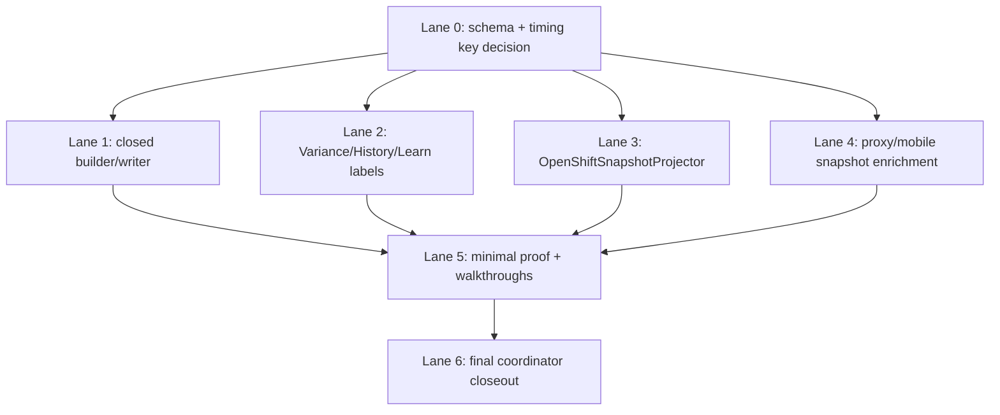

# 8.live-and-closed-truth Claude Prompt Packet

Date: 2026-05-06

Canonical branch: `master`

Remote baseline: `origin/master`

Purpose: give Claude/Codex lanes a clean execution packet for closing the two core slices without dragging in unrelated push, huge pressure, or admin-console work.

This packet assumes the repo default branch is `master`, not `main`. Every lane should start from the latest `origin/master`, create a lane branch, and avoid duplicating work from other lanes.

## What We Are Doing Now On Master

We are closing the core live + closed truth work:

1. `8.timing-provenance-closed`
   - Closed `shift_records` must persist the stable timing triplet.
   - Variance, History, and Learn must render labels from the saved timing truth, not from mutable current labels.

2. `8.spine-bridge-live`
   - Live canonical facts must project into `open_shift_snapshots`.
   - Mobile must pull those snapshots through proxy into existing SQLite `open_shift_snapshots`.
   - Shift Dashboard must render real live state from that path.

We are not doing push notifications in this sprint.

We are not doing the full pressure-test suite in this sprint.

We are not creating a duplicate `open_shift_snapshots_cache` table. The mobile app already has an `open_shift_snapshots` table. Extend that existing cache if needed.

We are not relying on a missing `business_timing_profile_versions` table unless a lane explicitly adds and documents it. Current `master` has `business_timing_profiles` and `business_timing_service_periods`.

## Must-Read Authority

Read these before coding:

1. `docs/_execution/2026-05-06_mobile_core_logic_data_wiring_contract.md`
2. `PROJECT_TRACKER.md`
3. `docs/contracts/integration_spine_architecture_contract.md`
4. `docs/contracts/phase_7_55_time_boundary_contract.md`
5. `docs/phases/phase_business_timing_live/business_timing_live_plan.md`
6. `CLAUDE.md`

## What Is Already On Master

Do not redo:

- Mobile proxy sync for closed `shift_records`.
- Mobile proxy sync for existing `open_shift_snapshots`.
- `HttpSyncProxyClient`.
- `MobileOperationalSyncRuntime`.
- `PostgresShiftRecordToMobileSync`.
- `public.open_shift_snapshots` server table from business timing live foundation.
- `OpenShiftSnapshotsRepository`.
- Business timing foundation tables:
  - `business_timing_profiles`
  - `business_timing_service_periods`
  - `business_timing_audit_events`
  - `open_shift_snapshots`
- Realtime fanout foundation.
- Seven accepted sink lanes listed in the sprint notes.

## What To Drop From The Old Sprint Prompt

Drop now:

- Push staging apply and connected-device push proof.
- iOS/Android push proof.
- Full large pressure suite as a blocking acceptance item.
- Duplicate mobile `open_shift_snapshots_cache` table.
- Any claim that `business_timing_profile_versions` already exists.
- Any instruction to put projector business logic randomly inside `advisor_proxy.dart`.
- Any closed-shift proof that makes the phone the authority for ending a shift.

Keep a small proof harness, but do not let tooling swallow the core slice.

## Lane Ordering

Lane 0 is the blocking schema/key lane.

After Lane 0 lands, Lanes 1, 2, 3, and 4 can run in parallel.

Lane 5 runs last.

Recommended order:

1. Lane 0: timing provenance schema and model decision
2. Lane 1: closed writer/builder propagation
3. Lane 2: closed label consumers
4. Lane 3: live projector
5. Lane 4: mobile/proxy snapshot enrichment
6. Lane 5: minimal proof harness and walkthrough closeout

## Prompt 0: Blocking Schema And Timing Key Lane

```text
You are working in Forge & Flow on the canonical branch baseline `origin/master`.

Slice: 8.live-and-closed-truth / Lane 0

Goal:
Land the additive schema and model foundation for closed + live timing provenance.

Authority:
1. docs/_execution/2026-05-06_mobile_core_logic_data_wiring_contract.md
2. docs/contracts/phase_7_55_time_boundary_contract.md
3. docs/contracts/integration_spine_architecture_contract.md
4. docs/phases/phase_business_timing_live/business_timing_live_plan.md
5. CLAUDE.md

Important current-master fact:
`business_timing_profiles` and `business_timing_service_periods` exist. A separate `business_timing_profile_versions` table may not exist. Do not write code that queries a missing table. First reconcile the version-id model:

- Preferred if supported by local contracts: treat immutable `business_timing_profiles.profile_id` as both profile id and current version id for now, and document that mapping.
- If contracts require a separate version table, add it additively and update repository/read code.
- Either way, downstream lanes must have one stable field called `business_timing_profile_version_id`.

Files likely touched:
- db/migrations/<timestamp>_phase_8_timing_provenance_closed_shift_records.sql
- lib/domain/models/closed_shift_input.dart
- lib/models/shift_record.dart
- lib/domain/models/open_shift_snapshot.dart, only if mobile/server wire shape needs the triplet in model
- docs/_walkthroughs/8.timing-provenance-closed.md, initial schema decision section

Requirements:
1. Add nullable columns to `public.shift_records`:
   - `business_timing_profile_id uuid`
   - `business_timing_profile_version_id uuid`
   - `service_period_key text`
2. Existing rows stay legacy/null.
3. New rows must be able to carry the triplet.
4. Add tenant-leading indexes. Do not create unsafe non-concurrent migrations if repo migration policy forbids it.
5. Extend domain models additively. Keep legacy `daypart` for compatibility.
6. Do not change formulas.
7. Do not rewrite old closed rows.
8. No em dash in operator-facing strings.

Tests:
- Add or update model/schema tests where existing migration tests live.
- Add a small domain model serialization test if there is a local pattern.

Acceptance:
- Migration is additive and rollback-safe.
- Code compiles with new fields available for downstream lanes.
- Walkthrough notes the version-id decision clearly.

Final response:
- List files changed.
- State the exact profile/version decision made.
- State tests run.
- Include any downstream lane contract changes.
```

## Prompt 1: Closed Builder And Writer Propagation

```text
You are working in Forge & Flow on a branch based on the latest `origin/master` after Lane 0 has landed.

Slice: 8.timing-provenance-closed / Lane 1

Goal:
Carry the timing triplet through closed shift input, shift fact building, and Postgres writing.

You are not alone in the codebase. Do not revert changes from other lanes. Work with the Lane 0 schema/model shape.

Files likely touched:
- lib/domain/models/closed_shift_input.dart
- lib/domain/services/shift_fact_builder.dart
- lib/infrastructure/persistence/postgres/postgres_shift_record_writer.dart
- lib/services/integration/canonical_fact_to_closed_shift_input.dart
- test/domain/services/shift_fact_builder_timing_provenance_test.dart
- test/infrastructure/persistence/postgres/postgres_shift_record_writer_timing_provenance_test.dart

Requirements:
1. `ClosedShiftInput` carries:
   - `businessTimingProfileId`
   - `businessTimingProfileVersionId`
   - `servicePeriodKey`
2. `ShiftFactBuilder.fromClosedShiftInput` preserves/passes the triplet to `ShiftRecord`.
3. Writer inserts the triplet into `public.shift_records`.
4. Replays/re-aggregation must not rewrite timing provenance on existing closed rows.
5. Existing target profile version preservation remains binding.
6. Legacy rows without timing triplet remain supported through `daypart`.
7. Do not change labor formulas or target formulas.

Tests:
- Builder writes triplet from input.
- Builder supports legacy input with null triplet.
- Writer round-trips triplet.
- Writer preserves triplet on update/replay.
- Existing `shift_fact_builder_test.dart` and writer tests still pass.

Acceptance:
- New closed rows carry the timing triplet.
- Re-aggregation does not mutate existing closed timing provenance.
```

## Prompt 2: Closed Label Consumer Lane

```text
You are working in Forge & Flow on a branch based on latest `origin/master` after Lane 0 has landed. Coordinate with Lane 1, but do not touch writer internals unless needed for compile.

Slice: 8.timing-provenance-closed / Lane 2

Goal:
Make Variance, History, and Learn display labels from saved timing truth when present, with fallback to legacy daypart when absent.

Files to inspect:
- lib/services/variance/**
- lib/services/history/**
- lib/services/learn/**
- lib/models/shift_record.dart
- lib/infrastructure/persistence/postgres/repositories/business_timing_profiles_repository.dart
- local read services that format daypart/service-period labels

Requirements:
1. If a closed row has `service_period_key` and saved timing profile/version, display the label from that saved timing identity.
2. If the row is legacy/null, use existing `daypart` fallback.
3. Renaming current timing labels must not change historical labels.
4. Do not re-bucket closed history.
5. Do not require mobile to have the full timing hierarchy if the saved row already includes enough display metadata. If more metadata is needed, document the minimal cache/proxy shape.

Tests:
- Variance label resolution from saved timing identity.
- History label resolution from saved timing identity.
- Learn label resolution from saved timing identity.
- Legacy fallback still works.
- Rename-current-profile test proves old labels do not drift.

Acceptance:
- Closed rows render version-snapshot labels across Variance, History, and Learn.
```

## Prompt 3: Live OpenShiftSnapshotProjector Lane

```text
You are working in Forge & Flow on a branch based on latest `origin/master` after Lane 0 has landed.

Slice: 8.spine-bridge-live / Lane 3

Goal:
Build the production `OpenShiftSnapshotProjector` that turns canonical in-flight POS/labor/reservation facts into rows in `public.open_shift_snapshots`.

You are not alone in the codebase. Own the projector service and projector tests. Do not refactor unrelated sink lanes.

Files likely new:
- lib/services/integration/open_shift_snapshot_projector.dart
- test/services/integration/open_shift_snapshot_projector_test.dart

Files likely touched:
- lib/infrastructure/persistence/postgres/repositories/open_shift_snapshots_repository.dart
- lib/infrastructure/persistence/postgres/repositories/business_timing_profiles_repository.dart
- canonical sink/worker seam only if needed to call the projector cleanly

Important:
Do not create a second mobile cache table. Do not put business logic in random proxy route code. Projector should sit in the canonical integration/service layer and write through repository seams.

Requirements:
1. Reads canonical fact dictionaries or typed canonical fact inputs.
2. Resolves business date and active timing profile for the location.
3. Buckets by stable `service_period_key`, never mutable label.
4. Upserts one row per service period into `open_shift_snapshots`.
5. Upserts Whole Day row as a rollup from service-period buckets.
6. Persists:
   - `business_timing_profile_id`
   - `business_timing_profile_version_id` if available after Lane 0 decision
   - `service_period_key`
7. Idempotent on canonical replay.
8. Cross-tenant isolated.
9. Does not write closed `shift_records`.

Tests:
- Single canonical write produces one service-period snapshot.
- Many writes in one service period upsert one row.
- Service-period rollover creates a second row.
- Whole Day row rolls up from period rows.
- Replay does not duplicate.
- Cross-tenant isolation.
- Missing timing profile produces honest unavailable/error result, not demo data.

Acceptance:
- Projector unit tests pass.
- Projector can be called from canonical sink/worker seam by downstream lane.
```

## Prompt 4: Proxy And Mobile Snapshot Enrichment Lane

```text
You are working in Forge & Flow on latest `origin/master` after Lane 0 has landed.

Slice: 8.spine-bridge-live / Lane 4

Goal:
Ensure open snapshot timing provenance flows through proxy and mobile into the existing SQLite `open_shift_snapshots` cache and read models.

Files likely touched:
- tool/advisor_proxy/proxy_bootstrap.dart
- tool/advisor_proxy/advisor_proxy.dart only if route shape requires it
- lib/services/sync/sync_proxy_client.dart
- lib/services/sync/http_sync_proxy_client.dart
- lib/services/sync/postgres_shift_record_to_mobile_sync.dart
- lib/domain/models/open_shift_snapshot.dart
- lib/infrastructure/persistence/sqlite/sqlite_database_schema.dart
- lib/infrastructure/persistence/sqlite/sqlite_database_migrations.dart
- lib/infrastructure/persistence/sqlite/dao/open_shift_snapshot_dao.dart
- Shift dashboard/read model files only if needed to render provenance/honest state

Requirements:
1. Extend existing mobile `open_shift_snapshots` table/model if needed.
2. Do not create `open_shift_snapshots_cache`.
3. Proxy returns timing provenance columns from server snapshots.
4. Mobile parses and persists them.
5. Existing Shift/Variance consumers keep working.
6. Shift Dashboard has honest states:
   - live
   - unavailable
   - stale
   - demo
   - first sync/backfill pending where applicable
7. Forced missing snapshot does not show demo as truth.

Tests:
- HTTP client parses new fields.
- Mobile sync writes new fields.
- Legacy snapshot rows without new fields still parse.
- Shift dashboard/read model handles unavailable/stale honestly.

Acceptance:
- A server `open_shift_snapshots` row with timing provenance appears in mobile SQLite with the same provenance.
```

## Prompt 5: Minimal Payload Harness And Proof Lane

```text
You are working in Forge & Flow after Lanes 1, 3, and 4 have minimally landed.

Slice: 8.live-and-closed-truth / Lane 5

Goal:
Create a small proof harness and walkthrough evidence for live + closed truth. Keep this lean. Do not build the full pressure test suite in this sprint.

Files likely new:
- tool/payload_harness/main.dart or a smaller existing-test helper if repo has a preferred place
- tool/payload_harness/README.md
- docs/_walkthroughs/8.spine-bridge-live.md
- docs/_walkthroughs/8.timing-provenance-closed.md
- docs/_execution/<date>_8_live_and_closed_truth_proof_execution.md

Requirements:
1. Simulate at least one accepted POS sink path and one labor/reservation support path if feasible.
2. Prove canonical fact -> live projector -> `open_shift_snapshots`.
3. Prove proxy -> mobile SQLite pull for open snapshots.
4. Prove closed input -> builder -> writer -> closed row with triplet.
5. Prove closed label does not drift after timing rename.
6. Keep pressure proof small:
   - idempotency replay
   - small burst in one service period
   - cross-tenant isolation
7. Do not include push notification proof.

Acceptance:
- Walkthroughs exist and are truthful.
- Proof doc lists pass/fail per required path.
- Tracker/punchlist updates are made only if implementation and tests really pass.
```

## Prompt 6: Final Coordinator Closeout Lane

```text
You are the final coordinator for `8.live-and-closed-truth-core`.

Start only after all implementation lanes have landed.

Goal:
Merge/reconcile lanes, run verification, update docs, and prepare ACCEPT evidence.

Tasks:
1. Rebase/merge all lane branches onto latest `origin/master`.
2. Resolve conflicts without reverting unrelated lane work.
3. Run targeted tests:
   - open_shift_snapshot_projector tests
   - shift_fact_builder timing provenance tests
   - Postgres writer timing provenance tests
   - sync proxy/mobile open snapshot tests
   - Variance/History/Learn label tests
4. Run broader analyzer/lints required by repo gates.
5. Run migration drift/cutoff/index-leading/RLS lints.
6. Verify walkthroughs.
7. Update `PROJECT_TRACKER.md` only when acceptance is genuinely proven.
8. Update `docs/_execution/2026-05-05_v1_launch_punchlist.md` only when timing provenance is genuinely proven.

Closeout must explicitly state:
- What passed.
- What was simulated.
- What was not run.
- Any follow-up that remains out of scope.
```

## Reference Map: Master Baseline And Lane Ownership

Use `origin/master` as the source of truth before each lane starts.

| Area | Current master state | Lane owner | Notes |
| --- | --- | --- | --- |
| Mobile closed shift sync | Exists | none | Do not redo. Extend only if new fields need parsing. |
| Mobile open snapshot sync | Exists | Lane 4 | Extend existing `open_shift_snapshots`; no duplicate cache table. |
| Server `open_shift_snapshots` table | Exists | Lane 3/Lane 4 | May need version-id column depending Lane 0 decision. |
| Business timing profiles | Exists | Lane 0 | Current schema has profiles and service periods. Version model must be reconciled. |
| Closed `shift_records` timing triplet | Missing | Lane 0/Lane 1 | Core closed truth gap. |
| `OpenShiftSnapshotProjector` | Missing | Lane 3 | Core live truth gap. |
| Variance/History/Learn label stability | Missing | Lane 2 | Must fall back for legacy rows. |
| Star shifts/manager override server truth | Out of this sprint | future | Covered by data wiring contract, not this two-slice sprint. |
| Target cycles/weekly plans server truth | Out of this sprint | future | Do not bundle into live/closed truth sprint. |
| Business scope hamburger | Out of this sprint | future | Covered by data wiring contract, not this sprint. |
| Push notifications | Out of this sprint | future | Drop from current execution. |
| Huge pressure tests | Out of this sprint | future | Keep only minimal idempotency/burst/isolation proof. |

## Parallel Execution Map



## Operator Message To Claude

Use this short instruction when launching Claude:

```text
We are closing `8.live-and-closed-truth-core` on `master` now.

Use `origin/master` as the canonical baseline. Do not redo existing mobile sync or business timing foundation work. Drop push notifications, the giant pressure suite, and the duplicate `open_shift_snapshots_cache` idea from this sprint.

Lane 0 must land first because it resolves the timing provenance schema and the profile/version-id decision. After Lane 0 lands, run the closed writer, closed label consumers, live projector, and proxy/mobile enrichment lanes in parallel. Then run the minimal proof/walkthrough lane and final coordinator closeout.

Follow:
1. `docs/_execution/2026-05-06_mobile_core_logic_data_wiring_contract.md`
2. `docs/_execution/2026-05-06_live_closed_truth_claude_prompt_packet.md`
3. existing contracts and tracker authority.

Do not mark tracker/punchlist ACCEPT until implementation, tests, migration checks, and proof docs actually pass.
```

