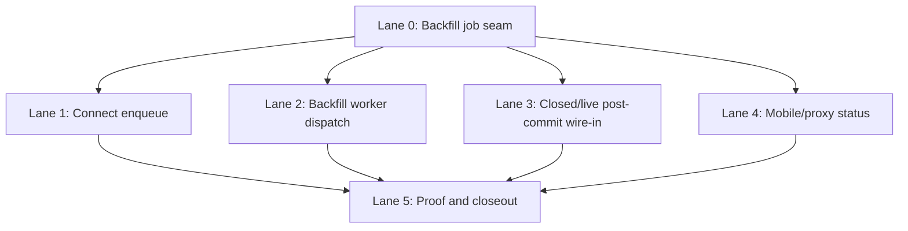

# Mobile Core First Connection Backfill Sprint Plan

Date: 2026-05-06
Branch: `codex/mobile-core-first-connect-backfill-plan`
Baseline: `origin/master` at `52ac1f4c`
Status: accepted 2026-05-06 after Lane 5 fixture proof

## Plain English

The last sprint landed the closed timing provenance and live snapshot
components. The open gap is production wiring: a real first connection still
does not reliably enqueue a 60-day backfill, run `adapter.backfill()`, write
closed rows, flip demo mode, and make mobile leave setup state without manual
seeding.

This sprint closes that first-connection path before moving into stars,
targets, and plans.

## Closeout Evidence

Lane 5 proof lives at:

- `tool/first_connection_backfill_harness/main.dart`
- `tool/first_connection_backfill_harness/README.md`
- `docs/_execution/2026-05-06_8_first_connection_backfill_proof.md`
- `docs/_walkthroughs/8.first-connect-backfill.md`

The proof is fixture-backed. It names live provider calls, live Postgres apply,
Cloud Run invocation, connected-device proof, push notification proof, and the
large pressure suite as out of scope for this sprint.

## Drill-Down Verdicts

| Claim | Code reality | Proof | Verdict |
| --- | --- | --- | --- |
| Doc 1 says first connection must enqueue a 60-day backfill. | `ConnectResult.firstBackfillStarted` exists, but there is no durable job claim surface or connect-route enqueue contract. | `lib/services/integration/integration_adapter_common.dart`; `tool/advisor_proxy/admin_integrations_routes.dart` | Partial |
| Doc 1 says worker runs adapter `backfill`. | Adapter `backfill()` methods exist, but the current worker dispatch calls only `pollIncremental()`. | `tool/integration_sync_worker/dispatch.dart`; `tool/integration_sync_worker/main.dart` | Partial |
| Doc 1 says demo flips after first committed batch with rows. | `DemoModeFlipPolicy` and sink-level `evaluateDemoFlip()` exist; the missing part is first-backfill orchestration invoking it from the claimed job. | `lib/services/integration/demo_mode_state.dart`; `lib/services/integration/canonical_sink.dart` | Partial |
| Doc 1 says canonical facts create closed `shift_records`. | The aggregator and writer exist, but tracker carry-forward correctly notes they are dormant until production wire-in invokes them. | `lib/services/integration/canonical_fact_to_closed_shift_input.dart`; `lib/infrastructure/persistence/postgres/postgres_shift_record_writer.dart` | Partial |
| Doc 1 says live facts create `open_shift_snapshots`. | `OpenShiftSnapshotProjector` exists and tests pass, but production sink/outbox wire-in is still open. | `lib/services/integration/open_shift_snapshot_projector.dart` | Partial |
| Doc 1 says mobile pulls server truth and stays cache-only. | Mobile/proxy sync paths exist for closed records, open snapshots, and demo mode. The first-backfill status path needs to reuse those patterns. | `lib/services/sync/postgres_shift_record_to_mobile_sync.dart`; `lib/services/sync/http_sync_proxy_client.dart` | Matches with status gap |

## Sprint Scope

Slice id: `8.first-connect-backfill-wire-in`

Done means a fixture-backed first connection can prove:

```text
connect
-> first-backfill work item
-> adapter.backfill()
-> canonical facts
-> closed shift_records
-> open_shift_snapshots where applicable
-> proxy pull
-> mobile SQLite
-> honest app status
```

## Lane Topology

Lane 0 ships first and defines the durable backfill seam. Lanes 1 through 4
run after Lane 0. Lane 5 is the proof/closeout gate.



## Lane 0 - Backfill Job Seam

Purpose: define the additive durable work contract every other lane consumes.

Likely new files:

- `lib/services/integration/first_connection_backfill_job.dart`
- `lib/infrastructure/persistence/postgres/repositories/connector_backfill_job_repository.dart`
- `test/services/integration/first_connection_backfill_job_test.dart`
- `test/infrastructure/persistence/postgres/connector_backfill_job_repository_test.dart`

Likely migration:

- `db/migrations/<timestamp>_phase_8_first_connection_backfill_jobs.sql`

Acceptance:

- Job table or equivalent claim surface is additive.
- One active job per connection/category/window.
- Claim query uses existing repository/RLS pattern and `FOR UPDATE SKIP LOCKED`
  if rows are claimed from Postgres.
- Indexes lead with `operator_id`.
- No mobile table created.

## Lane 1 - Connect Enqueue

Purpose: make OAuth callback and key-paste connection create first-backfill
work after credentials and `connector_connection` are persisted.

Likely touched files:

- `tool/advisor_proxy/admin_integrations_routes.dart`
- production gateway implementation in `tool/advisor_proxy/proxy_bootstrap.dart`
- route tests under `test/proxy/` or existing admin integration route tests

Acceptance:

- OAuth callback connect enqueues once.
- Key-paste connect enqueues once.
- Retried idempotency key does not duplicate the job.
- Vendor adapters returning `firstBackfillStarted: false` are respected and
  surface an honest status.
- No credential or live provider call is added to tests.

## Lane 2 - Backfill Worker Dispatch

Purpose: claim backfill work and invoke the existing adapter `backfill()` path.

Likely new files:

- `tool/integration_sync_worker/backfill_dispatch.dart`
- `test/tool/integration_sync_worker/backfill_dispatch_test.dart`

Likely touched files:

- `tool/integration_sync_worker/main.dart`
- `tool/integration_sync_worker/dispatch.dart` only if shared helpers are needed

Acceptance:

- Worker builds `BackfillCommand` with 60-day bounded window.
- Sanity hook is bound with `isDeliberateBackfill: true`.
- Watermark advances per committed batch through `CanonicalSink`.
- Zero-row backfill logs completion but does not flip demo.
- Partial backfill persists cursor and resumes.
- Adapter failure records sync/backfill failure and does not advance job to
  complete.

## Lane 3 - Closed And Live Post-Commit Wire-In

Purpose: invoke existing projection components from real canonical writes.

Likely new files:

- `lib/services/integration/canonical_fact_post_commit_projector.dart`
- `test/services/integration/canonical_fact_post_commit_projector_test.dart`

Likely touched files:

- Postgres sink seams only where an observer/hook must be passed.
- `tool/integration_sync_worker/backfill_dispatch.dart` if Lane 2 owns the
  orchestration call.

Acceptance:

- Completed service periods run through
  `CanonicalFactToClosedShiftInputAggregator` and `PostgresShiftRecordWriter`.
- Current/open service periods run through `OpenShiftSnapshotProjector`.
- Replays are idempotent.
- Prior closed timing and target provenance are preserved.
- Live projection never writes closed records.

## Lane 4 - Mobile And Proxy Backfill Status

Purpose: expose first-backfill status so screens can say exactly what is
missing while backfill runs or fails.

Likely touched files:

- `tool/advisor_proxy/advisor_proxy.dart`
- `tool/advisor_proxy/proxy_bootstrap.dart`
- `lib/services/sync/http_sync_proxy_client.dart`
- `lib/services/sync/mobile_operational_sync_runtime.dart`
- `lib/models/app_data_status.dart`
- `lib/services/app_data_status_service.dart`
- targeted sync/status tests

Acceptance:

- Mobile can distinguish first-sync pending, backfill running, backfill failed,
  historical-only, current, stale, and demo.
- Existing landed open snapshots are not masked by a running sync.
- No direct mobile Postgres/vendor calls.
- Existing `open_shift_snapshots` and `shift_records` caches are reused.

## Lane 5 - Proof And Closeout

Purpose: prove the first-connection spine with a small fixture harness.

Likely new files:

- `tool/first_connection_backfill_harness/main.dart`
- `tool/first_connection_backfill_harness/README.md`
- `docs/_execution/<date>_8_first_connection_backfill_proof.md`
- `docs/_walkthroughs/8.first-connect-backfill.md`

Acceptance:

- Harness proves connect to backfill job to adapter backfill to canonical facts.
- Harness proves closed rows become mobile-visible.
- Harness proves demo flips only after the first committed row.
- Harness proves current/open facts call the open snapshot projector.
- Proof names simulated pieces and avoids push notification proof.

## Prompt Packet

### Lane 0 - `8.first-connect-backfill.0` Backfill job seam

```text
## Block 1 - Human Context

Plain English: This lane creates the durable first-backfill work seam. Later
lanes enqueue, claim, run, and report these jobs, so this must land first.

Lane: `8.first-connect-backfill.0` - worktree
`.claude/worktrees/8-first-connect-backfill-0` on branch
`claude/8-first-connect-backfill-0` off master @ `52ac1f4c`.

Authority:
- `docs/contracts/mobile_core_first_connection_backfill_contract.md`
- `docs/_execution/2026-05-06_mobile_core_first_connection_backfill_sprint_plan.md`
- `docs/contracts/hardening_rls_and_repository_pattern_contract.md`

Current issue:
- First-connection backfill has adapter command types but no durable work item
  or claim contract.

Human prerequisites:
- Setup/access needed: none.
- Decision needed: none. If a queue table is added, it must be additive and
  operator-scoped.

## Block 2 - Claude Paste

Task:
- Add the durable first-backfill job seam and repository contract.

Files to modify:
- `db/migrations/<timestamp>_phase_8_first_connection_backfill_jobs.sql`
- `lib/services/integration/first_connection_backfill_job.dart`
- `lib/infrastructure/persistence/postgres/repositories/connector_backfill_job_repository.dart`
- `test/services/integration/first_connection_backfill_job_test.dart`
- `test/infrastructure/persistence/postgres/connector_backfill_job_repository_test.dart`

Files to leave alone:
- `tool/advisor_proxy/admin_integrations_routes.dart`
- `tool/integration_sync_worker/dispatch.dart`
- `lib/services/integration/canonical_fact_to_closed_shift_input.dart`
- `lib/services/integration/open_shift_snapshot_projector.dart`
- `PROJECT_TRACKER.md`

Hard constraints:
- Do not update trackers.
- Do not commit.
- Mobile remains a cache.
- No duplicate mobile cache tables.
- Banned items must be absent: KMS, parse_warnings, parse_partial,
  kStrictReplayFiveMinute, pg_advisory_lock, sigtermDrainHandler,
  inboundWebhookDLQTile, raw_payload_partition, pg_partman_raw.
- Raw `package:postgres` imports stay under
  `lib/infrastructure/persistence/postgres/`.

Implementation tasks:
1. Add a job model with operator id, location id, connection id, vendor id,
   category, window start/end, cursor, status, attempt metadata, and timestamps.
2. Add an additive migration for the durable job/claim surface.
3. Add repository methods: enqueueFirstBackfill, claimNext, markRunning,
   markSucceeded, markFailed, and releaseForResume.
4. Make enqueue idempotent for the same connection/category/window.

Required tests:
- Model validation rejects invalid windows and empty identifiers.
- Repository SQL uses operator-leading indexes and tenant context.
- Claim query is race-safe and does not claim completed jobs.
- Idempotent enqueue returns the existing active job.
- Banned-items grep over new source files.

Acceptance criteria:
- [ ] All tests pass.
- [ ] Migration lints pass when run by coordinator.
- [ ] Zero changes to sibling lane files.
- [ ] No mobile cache/schema additions.
- [ ] Report using the standard execution report.
```

### Lane 1 - `8.first-connect-backfill.1` Connect enqueue

```text
## Block 1 - Human Context

Plain English: This lane wires first-backfill enqueue into successful vendor
connect paths. It does not run the job; it only creates the durable work item.

Lane: `8.first-connect-backfill.1` - worktree
`.claude/worktrees/8-first-connect-backfill-1` on branch
`claude/8-first-connect-backfill-1` off master @ `52ac1f4c`.

Authority:
- `docs/contracts/mobile_core_first_connection_backfill_contract.md`
- `docs/contracts/integration_spine_architecture_contract.md`
- `docs/_execution/2026-05-06_mobile_core_first_connection_backfill_sprint_plan.md`

Current issue:
- Admin connect routes persist credentials/connections, but there is no proven
  first-backfill enqueue after successful connect.

Human prerequisites:
- Setup/access needed: none.
- Decision needed: none.

## Block 2 - Claude Paste

Task:
- Enqueue first-backfill work after successful OAuth callback or key-paste
  connect, using Lane 0's repository seam.

Files to modify:
- `tool/advisor_proxy/admin_integrations_routes.dart`
- `tool/advisor_proxy/proxy_bootstrap.dart`
- existing targeted proxy route tests or new focused tests under `test/proxy/`

Files to leave alone:
- Lane 0 files except imports/constructor use if necessary.
- `tool/integration_sync_worker/backfill_dispatch.dart`
- `lib/services/integration/canonical_fact_post_commit_projector.dart`
- `PROJECT_TRACKER.md`

Hard constraints:
- Do not update trackers.
- Do not commit.
- No live vendor calls in tests.
- Connect retry must not duplicate jobs.
- Respect adapters that return `firstBackfillStarted: false`.

Implementation tasks:
1. Extend the production gateway dependency shape to accept the Lane 0
   backfill repository.
2. On successful OAuth callback connect, enqueue a 60-day first-backfill job.
3. On successful key-paste connect, enqueue the same job.
4. Include backfill job/status fields in the route response where the existing
   response shape allows additive fields.

Required tests:
- OAuth callback enqueues once.
- Key-paste connect enqueues once.
- Idempotent retry returns the same job.
- Adapter opt-out does not enqueue and reports deferred/unavailable status.
- Permission gates remain unchanged.

Acceptance criteria:
- [ ] All tests pass.
- [ ] No duplicate jobs on replay.
- [ ] No credential or provider behavior changed.
- [ ] Report using the standard execution report.
```

### Lane 2 - `8.first-connect-backfill.2` Backfill worker dispatch

```text
## Block 1 - Human Context

Plain English: This lane makes the worker claim first-backfill jobs and call
the existing adapter `backfill()` method with a bounded 60-day command.

Lane: `8.first-connect-backfill.2` - worktree
`.claude/worktrees/8-first-connect-backfill-2` on branch
`claude/8-first-connect-backfill-2` off master @ `52ac1f4c`.

Authority:
- `docs/contracts/mobile_core_first_connection_backfill_contract.md`
- `docs/contracts/integration_spine_architecture_contract.md`
- `docs/contracts/phase_7_55_time_boundary_contract.md`

Current issue:
- Worker dispatch currently drives `pollIncremental()`, not durable first
  backfill jobs.

Human prerequisites:
- Setup/access needed: none.
- Decision needed: none.

## Block 2 - Claude Paste

Task:
- Implement backfill job dispatch against Lane 0's job repository and existing
  adapter `backfill()` APIs.

Files to modify:
- `tool/integration_sync_worker/backfill_dispatch.dart`
- `test/tool/integration_sync_worker/backfill_dispatch_test.dart`
- `tool/integration_sync_worker/main.dart` only for additive entrypoint wiring

Files to leave alone:
- `tool/advisor_proxy/admin_integrations_routes.dart`
- `lib/services/integration/open_shift_snapshot_projector.dart`
- `lib/services/integration/canonical_fact_to_closed_shift_input.dart`
- `PROJECT_TRACKER.md`

Hard constraints:
- Do not update trackers.
- Do not commit.
- Backfill window stays bounded.
- Sanity hook must call adapters with `isDeliberateBackfill: true`.
- Watermark persists per committed batch.

Implementation tasks:
1. Claim one or more pending jobs through Lane 0 repository.
2. Resolve the correct adapter by category/vendor.
3. Build `BackfillCommand` with window, cursor, tenant ids, actor, and sanity hook.
4. Call `adapter.backfill()`.
5. Persist cursor, status, and sync log outcomes.
6. Call `CanonicalSink.evaluateDemoFlip()` only when the backfill committed at
   least one row.

Required tests:
- Happy path calls adapter.backfill once with a 60-day window.
- Sanity hook receives `isDeliberateBackfill: true`.
- Partial result persists cursor and leaves job resumable.
- Zero-row completion does not flip demo.
- Adapter throw records failure and preserves retry/resume state.

Acceptance criteria:
- [ ] All tests pass.
- [ ] No poll path regression.
- [ ] No custom drain handler or advisory lock.
- [ ] Report using the standard execution report.
```

### Lane 3 - `8.first-connect-backfill.3` Closed/live post-commit wire-in

```text
## Block 1 - Human Context

Plain English: The closed aggregator and live projector exist but are dormant.
This lane wires them into the canonical fact commit path without changing their
formula logic.

Lane: `8.first-connect-backfill.3` - worktree
`.claude/worktrees/8-first-connect-backfill-3` on branch
`claude/8-first-connect-backfill-3` off master @ `52ac1f4c`.

Authority:
- `docs/contracts/mobile_core_first_connection_backfill_contract.md`
- `docs/contracts/integration_spine_architecture_contract.md`
- `docs/_execution/2026-05-06_8_live_and_closed_truth_proof_execution.md`

Current issue:
- Existing projector/aggregator tests pass under fakes, but production sink or
  worker code does not yet invoke them.

Human prerequisites:
- Setup/access needed: none.
- Decision needed: none.

## Block 2 - Claude Paste

Task:
- Add the post-commit orchestration seam that invokes closed aggregation for
  completed periods and live projection for open/current periods.

Files to modify:
- `lib/services/integration/canonical_fact_post_commit_projector.dart`
- `test/services/integration/canonical_fact_post_commit_projector_test.dart`
- Minimal sink/worker call sites needed to invoke the new seam

Files to leave alone:
- Internal formula logic in `ShiftFactBuilder`.
- Existing aggregation rules in `canonical_fact_to_closed_shift_input.dart`
  unless only constructor dependency injection is needed.
- Existing projector rules in `open_shift_snapshot_projector.dart`.
- `PROJECT_TRACKER.md`

Hard constraints:
- Do not update trackers.
- Do not commit.
- No formula changes.
- Closed replays preserve prior target and timing provenance.
- Open snapshots do not write closed rows.

Implementation tasks:
1. Define a post-commit input that names operator, location, vendor/category,
   changed business dates, changed service period keys, and whether the period
   is complete or open.
2. Invoke `CanonicalFactToClosedShiftInputAggregator` plus
   `PostgresShiftRecordWriter` for complete periods.
3. Invoke `OpenShiftSnapshotProjector` for current/open periods.
4. Emit or preserve existing realtime/outbox signal shape where applicable.

Required tests:
- Closed complete period writes one `shift_records` row.
- Replay preserves prior timing and target provenance.
- Current/open period writes one open snapshot plus Whole Day rollup.
- Cross-tenant inputs do not mix rows.
- Missing timing profile returns an honest unavailable/error result.

Acceptance criteria:
- [ ] All tests pass.
- [ ] Existing live/closed component tests continue to pass.
- [ ] No source of truth moved to mobile.
- [ ] Report using the standard execution report.
```

### Lane 4 - `8.first-connect-backfill.4` Mobile/proxy status

```text
## Block 1 - Human Context

Plain English: While first backfill runs, mobile needs an honest state instead
of demo or blank screens. This lane exposes first-backfill status through the
existing proxy/mobile cache shape.

Lane: `8.first-connect-backfill.4` - worktree
`.claude/worktrees/8-first-connect-backfill-4` on branch
`claude/8-first-connect-backfill-4` off master @ `52ac1f4c`.

Authority:
- `docs/contracts/mobile_core_first_connection_backfill_contract.md`
- `docs/_execution/2026-05-06_mobile_core_logic_data_wiring_contract.md`
- `docs/contracts/slice_runtime_acceptance_contract.md`

Current issue:
- `AppDataStatus` can express backfill pending, but the server first-backfill
  job status is not yet part of the proven sync/status path.

Human prerequisites:
- Setup/access needed: none.
- Decision needed: none.

## Block 2 - Claude Paste

Task:
- Expose first-backfill status through proxy sync and mobile app status without
  adding direct mobile server access.

Files to modify:
- `tool/advisor_proxy/advisor_proxy.dart`
- `tool/advisor_proxy/proxy_bootstrap.dart`
- `lib/services/sync/http_sync_proxy_client.dart`
- `lib/services/sync/mobile_operational_sync_runtime.dart`
- `lib/models/app_data_status.dart`
- `lib/services/app_data_status_service.dart`
- targeted tests for proxy, sync client, runtime, and app data status

Files to leave alone:
- Mobile SQLite table creation unless a minimal existing import/status table
  extension is unavoidable.
- `open_shift_snapshots` schema except existing provenance fields.
- `PROJECT_TRACKER.md`

Hard constraints:
- Do not update trackers.
- Do not commit.
- Mobile reads proxy/cache only.
- Do not mask already-landed open snapshots as first-sync pending.
- No duplicate open snapshot cache.

Implementation tasks:
1. Add backfill job/status rows to the proxy sync surface.
2. Parse and persist or map status into existing mobile import/status storage.
3. Extend status evaluation so screens distinguish running, failed, no data,
   demo, stale, and current.
4. Keep legacy/no-status payloads backward compatible.

Required tests:
- Proxy returns active first-backfill status.
- HTTP client parses status.
- Runtime writes status without disturbing open snapshots.
- AppDataStatus returns backfillPending while no truth rows exist and job is
  running.
- AppDataStatus returns current when rows have landed even if a later sync is
  still running.

Acceptance criteria:
- [ ] All tests pass.
- [ ] No mobile direct vendor/Postgres calls.
- [ ] Empty/setup states explain the missing upstream piece.
- [ ] Report using the standard execution report.
```

### Lane 5 - `8.first-connect-backfill.5` Proof and closeout

```text
## Block 1 - Human Context

Plain English: This lane proves the sprint with a small fixture harness. It is
not a huge pressure suite and it does not do push notification proof.

Lane: `8.first-connect-backfill.5` - worktree
`.claude/worktrees/8-first-connect-backfill-5` on branch
`claude/8-first-connect-backfill-5` off master @ `52ac1f4c`.

Authority:
- `docs/contracts/mobile_core_first_connection_backfill_contract.md`
- `docs/_execution/2026-05-06_mobile_core_first_connection_backfill_sprint_plan.md`
- `docs/frameworks/MOBILE_WEB_CONSOLE_E2E_FRAMEWORK.md`

Current issue:
- Component tests exist, but no first-connect to mobile-visible-history proof
  exists yet.

Human prerequisites:
- Setup/access needed: none for fixture proof.
- Decision needed: none.

## Block 2 - Claude Paste

Task:
- Build a minimal fixture harness and closeout docs for the first-connection
  backfill spine.

Files to modify:
- `tool/first_connection_backfill_harness/main.dart`
- `tool/first_connection_backfill_harness/README.md`
- `docs/_execution/<date>_8_first_connection_backfill_proof.md`
- `docs/_walkthroughs/8.first-connect-backfill.md`

Files to leave alone:
- Implementation lane files except for import fixes required by integration.
- `PROJECT_TRACKER.md` until Codex accepts proof.

Hard constraints:
- Do not update trackers before proof passes.
- Do not commit.
- No push notification proof.
- No huge pressure suite.
- No live vendor/provider calls.

Implementation tasks:
1. Simulate a successful connect result and first-backfill enqueue.
2. Simulate accepted POS, labor, and reservation backfill writes using accepted
   adapter/sink surfaces.
3. Prove canonical facts produce closed rows and mobile can pull them.
4. Prove current/open facts produce open snapshots.
5. Prove demo flips only after first committed row.
6. Document what was simulated and what remains future work.

Required tests:
- Harness command passes.
- Targeted tests from Lanes 0 through 4 pass.
- Analyzer passes.
- Migration drift/cutoff/index-leading/RLS/Postgres import lints pass.

Acceptance criteria:
- [ ] First connection to mobile-visible closed history is proven.
- [ ] Demo flip policy is proven.
- [ ] Open projector production wire-in is proven under fixture inputs.
- [ ] No out-of-scope star/target/plan changes.
- [ ] Report using the standard execution report.
```

## Sequencing

1. Lane 0 lands first.
2. Lanes 1 through 4 run in parallel after Lane 0.
3. Lane 5 runs after Lanes 1 through 4 land.
4. Codex reviews each lane against
   `docs/contracts/mobile_core_first_connection_backfill_contract.md`.
5. Tracker updates happen only after Lane 5 proof passes.

## Not In This Sprint

- Star shift selection server truth.
- Target cycles.
- Active target profiles.
- Weekly plan snapshots.
- Business scope selector.
- Full connected-device E2E.
- Push notifications.
- Huge pressure suite.
