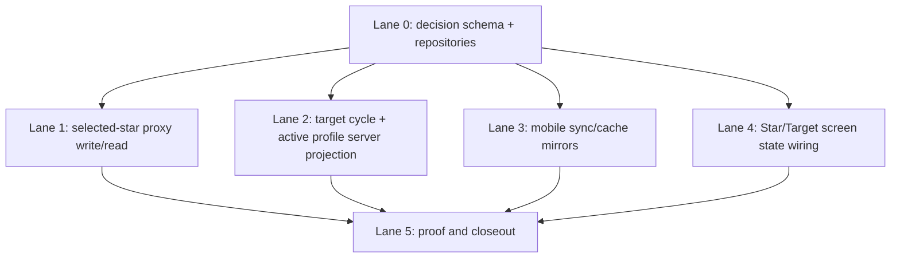

# Mobile Core Star And Target Truth Sprint Plan

Date: 2026-05-06
Branch: `codex/mobile-core-star-target-truth-plan`
Baseline: latest `origin/master` after `8.first-connect-backfill-wire-in`
Status: planning packet

## Plain English

The first-connect sprint gets real closed history into mobile. The next Doc 1
gap is shared business decision truth: selected star shifts, manager override
state, target cycles, and active target profiles are still local/mobile owned.

This sprint moves those shared decisions to the server while reusing the
existing mobile SQLite tables as cache.

## Drill-Down Verdicts

| Claim | Code reality | Proof | Verdict |
| --- | --- | --- | --- |
| Doc 1 says selected stars must be server truth. | `BaselineSelectionRepository` and its SQLite implementation exist, but no Postgres/proxy owner was found. | `lib/domain/repositories/baseline_selection_repository.dart`; `lib/infrastructure/persistence/sqlite/repositories/sqlite_baseline_selection_repository.dart` | Partial |
| Doc 1 says manager override must be permission checked and audit logged. | `TargetCyclePolicy` and `TargetCycleService` enforce local once-per-cycle rules, but auth/audit is not a server write path. | `lib/services/target_cycle_service.dart`; `lib/domain/services/target_cycle_policy.dart` | Partial |
| Doc 1 says target cycles must be server truth. | Domain and SQLite repositories exist; repo search found no Postgres/proxy target-cycle persistence. | `lib/domain/repositories/target_cycle_repository.dart`; `lib/infrastructure/persistence/sqlite/repositories/sqlite_target_cycle_repository.dart` | Partial |
| Doc 1 says active target profiles must be server truth. | Domain and SQLite repositories exist; repo search found no Postgres/proxy active-profile persistence. | `lib/domain/repositories/target_profile_repository.dart`; `lib/infrastructure/persistence/sqlite/repositories/sqlite_target_profile_repository.dart` | Partial |
| Doc 1 says weekly plan snapshots must be server truth. | Local weekly plan snapshot tables/services exist, but weekly plan is intentionally out of this sprint. | `lib/services/weekly_plan_snapshot_service.dart`; `lib/infrastructure/persistence/sqlite/repositories/sqlite_weekly_plan_snapshot_repository.dart` | Future |

## Sprint Scope

Slice id: `8.star-target-server-truth`

Done means a fixture-backed manager selection can prove:

```text
closed history
-> star candidates
-> selected-star write through proxy
-> server permission/idempotency/audit
-> target cycle replacement
-> active target profile projection
-> proxy/mobile sync
-> same truth visible on another device
```

## Lane Topology

Lane 0 lands first and defines the server decision schema. Lanes 1 through 4
run after Lane 0. Lane 5 is the proof/closeout gate.



## Lane 0 - Decision Schema And Repositories

Purpose: define the additive server truth tables and repository contracts that
all downstream lanes consume.

Likely new files:

- `db/migrations/<timestamp>_phase_8_star_target_truth.sql`
- `lib/infrastructure/persistence/postgres/repositories/selected_star_shift_repository.dart`
- `lib/infrastructure/persistence/postgres/repositories/target_cycle_repository.dart`
- `lib/infrastructure/persistence/postgres/repositories/active_target_profile_repository.dart`
- focused repository and migration tests

Acceptance:

- Selected-star, target-cycle, and active-profile tables are additive.
- Tables are operator-scoped and RLS-enabled.
- Hot-path indexes lead with `operator_id`.
- Selected-star rows preserve recommendation-vs-manager decision provenance.
- No mobile schema is added.

## Lane 1 - Selected-Star Proxy Write/Read

Purpose: route manager select/clear through the proxy instead of local-only
SQLite writes.

Likely touched files:

- `tool/advisor_proxy/advisor_proxy.dart`
- `tool/advisor_proxy/proxy_bootstrap.dart`
- targeted proxy route tests

Acceptance:

- Select and clear are permission checked.
- Idempotency key prevents duplicate decision rows.
- Audit event is written for select and clear.
- Read route returns selected-star truth for sync.
- Recommendation rows are not fabricated as manager rows.

## Lane 2 - Target Cycle And Active Profile Server Projection

Purpose: turn selected-star decisions into server-owned target cycle and active
target profile truth.

Likely touched files:

- `lib/services/target_cycle_service.dart` only through an injectable server
  seam or adapter, not formula rewrites
- `lib/domain/services/target_cycle_active_target_profile_projector.dart`
- new server projection/orchestration service and tests

Acceptance:

- Manager override uses server-selected stars.
- Once-per-cycle denial is enforced server-side.
- Replacement preserves source, selected-shift summary, calibration window,
  effective window, wage inputs, OPZ floor/ceiling, and override metadata.
- Active target profile is projected from the server target cycle.
- Formula behavior remains unchanged.

## Lane 3 - Mobile Sync And Cache Mirrors

Purpose: make mobile pull selected stars, target cycles, and active profiles
through the proxy into existing SQLite mirrors.

Likely touched files:

- `lib/services/sync/http_sync_proxy_client.dart`
- `lib/services/sync/mobile_operational_sync_runtime.dart`
- existing SQLite DAO/repository cache paths for baseline selections, target
  cycles, and active target profiles
- targeted sync tests

Acceptance:

- Existing mobile tables are reused as caches.
- Legacy/no-server payloads produce honest setup/unavailable states.
- Sync is operator/location scoped.
- Cross-device refresh sees server truth.

## Lane 4 - Star/Target Screen State Wiring

Purpose: ensure core mobile screens do not silently fall back to local-only
business truth when server truth is required.

Likely touched files:

- `lib/screens/baseline_manager_screen.dart`
- `lib/services/baseline_manager_service.dart`
- `lib/services/app_data_status_service.dart`
- focused widget/service tests

Acceptance:

- Star/Baseline selection writes through proxy.
- Permission denied state is visible.
- Target unavailable state is visible when server profile is missing.
- Recommendations remain visible without pretending to be manager selections.

## Lane 5 - Proof And Closeout

Purpose: prove the sprint with a small fixture harness and closeout docs.

Likely new files:

- `tool/star_target_truth_harness/main.dart`
- `tool/star_target_truth_harness/README.md`
- `docs/_execution/<date>_8_star_target_truth_proof.md`
- `docs/_walkthroughs/8.star-target-server-truth.md`

Acceptance:

- Harness proves selection on one device appears on another after sync.
- Harness proves clear syncs.
- Harness proves permission denial writes no decision row.
- Harness proves idempotent retry does not duplicate.
- Harness proves manager override creates/replaces server target cycle and
  active target profile.
- Proof names simulated pieces and avoids weekly plan, push, live-provider, and
  pressure-suite work.

## Prompt Packet

Use the prompt shape in `docs/CODEX_PROMPT_GENERATION_STANDARD.md`.

Lane 0 must ship first. Lanes 1 through 4 can run in parallel only after Lane 0
lands. Lane 5 runs last and is proof-only.

## Not In This Sprint

- Weekly plan snapshot server truth.
- Business scope hamburger selector.
- Group/region/company rollups.
- Admin org/location settings expansion beyond permissions needed for writes.
- Push notification proof.
- Huge pressure suite.
