# Core App Architecture

Status: **Active authority** (Tier-2 contract)
Updated: 2026-05-06
Owner: Codex architecture
Authority position:

- Below `docs/contracts/phase_7_55_architecture_contract.md` (the original
  binding hard-edged contract this assembles from)
- Beside `docs/contracts/phase_7_55_plain_english_architecture.md` (the
  paired explainer)
- Above any phase doc, slice doc, or implementation contract under
  `docs/contracts/integration_spine_architecture_contract.md`,
  `docs/contracts/metric_card_honesty_contract.md`, etc.

Companions absorbed verbatim into this assembly:

- `docs/archive/reference/architecture_pipeline.md` (the flowchart)
- `docs/contracts/phase_7_55_plain_english_architecture.md` (plain-english
  explainer; full text preserved as Appendix A)
- `docs/contracts/phase_7_55_architecture_contract.md` (binding rules; full
  text preserved as Appendix B)

When this doc and a phase doc / implementation contract conflict, this doc
wins. When this doc and the source contracts (Appendix A / B) conflict,
the source contracts win — this doc is a re-assembly, not a rewrite.

---

## Why this doc exists

The repo has accumulated three separate but related architecture docs (the
plain-english explainer, the binding contract, and the archived flowchart).
Phase 8 / 8R / 8.S brought live integrations into the picture and the
spine-bridge sprint adds another implementation layer (Phase 8.0 framework
+ Wave B adapters + spine bridge) that needs to bind to the same north-star
shape.

This doc is the single re-assembly so that:

- A new engineer (Codex or Claude) reads ONE doc to understand the whole
  architecture.
- The spine-bridge sprint and every future integration sprint binds to the
  same canonical pipeline.
- The flowchart, plain-english explainer, and binding rules stay in lock
  step.

---

## The North-Star Pipeline (visual)

```mermaid
flowchart LR
    subgraph S1[" SOURCE · continuous "]
        direction TB
        POS([POS]):::source
        LAB([Labor]):::source
        RES([Reservation]):::source
    end

    subgraph S2[" STANDARDS · locks every 60 days "]
        direction TB
        FACTS([Canonical<br/>Facts]):::source
        BENCH([60-Day<br/>Benchmark]):::std
        TC([Target<br/>Cycle]):::std
    end

    subgraph S3[" PLAN · regenerates every week "]
        direction TB
        FC([Demand<br/>Forecast]):::plan
        WP([Weekly<br/>Plan]):::plan
        WP -.->|new plan auto-locks<br/>every business week| FC
    end

    subgraph S4[" OPERATE · live daily "]
        direction TB
        SH([Shift]):::live
        FS([Full Shift<br/>whole-day]):::live
        DP([Service Periods<br/>1-4 configured]):::future
        VAR([Variance]):::live
        SH --> FS
        SH --> DP
        FS --> VAR
        DP --> VAR
    end

    subgraph S5[" LEARN · closed truth "]
        direction TB
        HIST([History]):::learn
        LEARN([Learn]):::learn
    end

    POS --> FACTS
    LAB --> FACTS
    RES --> FACTS
    FACTS --> BENCH
    BENCH --> TC
    TC --> FC
    FC --> WP
    WP --> SH
    VAR --> HIST
    HIST --> LEARN
    LEARN -.->|learned patterns inform next cycle<br/>for that specific restaurant|TC

    classDef source fill:#F97316,stroke:#C2410C,stroke-width:2px,color:#fff,font-weight:bold
    classDef std fill:#0891B2,stroke:#155E75,stroke-width:2px,color:#fff,font-weight:bold
    classDef plan fill:#06B6D4,stroke:#0891B2,stroke-width:2px,color:#fff,font-weight:bold
    classDef live fill:#22D3EE,stroke:#0891B2,stroke-width:2px,color:#0c4a6e,font-weight:bold
    classDef learn fill:#155E75,stroke:#0c4a6e,stroke-width:2px,color:#fff,font-weight:bold
    classDef future fill:#0c4a6e,stroke:#A5F3FC,stroke-width:2px,stroke-dasharray:5 5,color:#A5F3FC,font-weight:bold
```



Source: `docs/archive/reference/architecture_pipeline.md`. Embedded
verbatim. Five regions, five cadences, five different jobs.

---

## The Big Idea (plain-english summary)

There are three different things the app must keep separate:

1. **What "good" looks like** (standards)
2. **How much business is expected** (demand)
3. **What actually happened** (actuals)

If those blur together, the screens may still look nice but the product
starts quietly lying. The architecture exists to keep them separate.

The five-stage pipeline is:

1. **Source** systems (POS / Labor / Reservation) push raw operational
   facts in continuously.
2. **Standards** lock every 60 days. Benchmark looks back at closed
   history, recommends a `TargetCycle`, the cycle locks for 60 days.
3. **Plan** regenerates every business week. Demand forecast plus the
   locked target cycle plus distribution logic equals the
   `WeeklyPlanSnapshot` — the plan-in-force for one week, which does not
   rewrite midweek.
4. **Operate** is live daily. Shift compares live operational facts
   against the locked plan + standards. Variance compares closed/open/
   projected truth against the same locked context.
5. **Learn** is the closed-truth tail. History stores frozen closed
   reality with the cycle/week context that was active when those facts
   closed. Learn teaches from repeated closed evidence interpreted
   against current benchmark context — but historical evidence retains
   its original cycle/week provenance.

Each stage has its own cadence:

| Stage | Cadence | What changes |
|---|---|---|
| Source | Continuous | New facts arrive |
| Standards | 60 days | TargetCycle, target standards, manager override eligibility |
| Plan | Weekly | WeeklyPlanSnapshot, week-in-force comparison plan |
| Operate (live) | Continuous during operations | OpenShiftSnapshot, reservation-book context, live Shift view |
| Operate (closed) | Only when shifts close | Closed shift truth, WTD closed facts |
| Learn | Closed truth only | History pattern evidence, Learn evidence |

---

## The Three Hard Promises (mandatory)

### Promise 1: Source systems own raw truth; the app owns canonical truth

External vendors send vendor-shaped data. The app **never** exposes vendor
shape directly to the UI. Every vendor payload gets normalized into one of
three canonical operational fact shapes:

- `ShiftRecord` = closed-shift actual truth
- `OpenShiftSnapshot` = live in-progress shift truth
- `ReservationBookSnapshot` = reservation-book truth by business-date bucket

Later integrations replace **transport** (how facts arrive) without
creating a second UI-facing truth path.

### Promise 2: Locked truth never gets rewritten

Three things lock and stay locked:

- **Already closed shifts** stay graded under the cycle that was active
  when they closed. A new TargetCycle in force next month does not
  re-grade last month's history. Closed rows also preserve the timing
  profile/version id and stable service_period_key used for bucket-time
  classification; later timing edits, labels, or overrides do not silently
  rewrite historical buckets.
- **WeeklyPlanSnapshot** locks for one business week. Once locked, it
  does not regenerate midweek even if the forecast plan changes.
- **Cycle/week provenance** stays attached to closed facts forever.
  Learn teaches against current benchmark context but historical
  evidence retains its original cycle/week provenance.

If a vendor pushes a corrected fact 6 months after the original close,
the canonical fact gets overwritten on `vendor_modified_at` last-write-
wins, the daypart re-aggregates, and the resulting `ShiftRecord` row
**preserves the original `target_profile_version_id` from the prior
close** — never the current cycle. (This rule was made explicit in the
spine-bridge contract; see `integration_spine_architecture_contract.md`
Concern A.)

### Promise 3: Live, closed, projected, and fallback states stay
distinguishable

Variance has to mix closed/open/projected rows, but the rows must never
sound equally final.

- **Closed rows** = locked truth.
- **Open rows** = live in-progress context (`OpenShiftSnapshot`).
- **Projected rows** = plan / forecast context.
- **Fallback values** = computed from operator-sanctioned defaults
  when source data is unavailable (e.g., target wage × hours when labor
  vendor doesn't push dollars; F&F-derived forecast covers when POS
  doesn't expose covers). Fallback values render as numbers but always
  carry explicit provenance — see `metric_card_honesty_contract.md`.

Every metric carries `state` ∈ {`live`, `partial`, `fallback`,
`unavailable`} plus a provenance string in the read model. The renderer
switches on state. `unavailable` triggers `MetricCardNotYetAvailable`;
all other states render the number; the dashboard health pill summarizes
non-live states.

Live service-period rows are not UI slices of an already-rounded whole-day
row. Live canonical POS/labor/reservation facts must be bucketed into the
effective configured service periods first, including interval splitting for
labor punches; Whole Day is then a rollup from those buckets. Future or
unavailable service periods render honest projected/unavailable states rather
than borrowing a closed or whole-day driver.

---

## Layer Contract (binding rules per stage)

### Layer 1 — Source systems

**POS owns:** sales truth, ticket / check truth, covers truth when POS is
the reliable source, close / finalization truth when available, source
timestamps.

**Labor owns:** schedules, published staffing context, punches /
timecards, worked hours, labor dollars or wage truth when exposed. Some
integrations expose only hours at close time; in that case the app may
use the sanctioned wage-authority seam as an operational fallback.

**Reservation owns:** reservation party size, reservation time,
reservation status, status timestamps, booked covers still in the books.

### Layer 2 — Canonical operational facts

The app's normalized truth layer. Vendor data, cleaned into app data.

- `ShiftRecord` = closed-shift actual truth
- `OpenShiftSnapshot` = live in-progress shift truth
- `ReservationBookSnapshot` = reservation-book truth by business-date bucket
- `cover_facts`, `labor_punches`, `reservation_facts` (operator-scoped
  Postgres) = per-vendor canonical fact rows that aggregate into the
  three shapes above

UI never reads vendor payload shape. Canonical facts are not themselves
benchmark standards or plan values. Later integrations replace transport,
not create a second UI-facing truth path.

### Layer 3 — 60-Day Benchmark

Calibration evidence built from **closed truth only**. Reservation data
can help forecast demand later, but does not rewrite the benchmark
standard. Benchmark is calibration input, not the live operating target.

### Layer 4 — TargetCycle

The locked 60-day standards window. Owns target CPLH, target SPLH, target
PPA, OPZ bounds, source provenance.

- Standards lock for 60 days
- Cycle effective windows align to the operator's configured
  `week_start_day`. Cycle length is 60–66 days per operator depending on
  where the 60-day boundary falls relative to the week-start. Auto-refresh
  defers to the next week-start day when the 60-day boundary lands
  mid-week (see Phase 7.55 Time Boundary Contract, Rules 5–6).
- Manager can override once per cycle
- Admin can replace with explicit provenance
- A new cycle affects future comparison context only
- A new cycle does not re-grade already closed history
- **Wage authority is a sanctioned companion seam.** Per Jim Taylor's
  labor model the model consumes exactly two wage numbers per location
  (FOH wage, BOH wage), each derived from `wage_role_rows` weighted-up
  by `labor_bucket`. Labor integration wage truth qualifies in four
  source classes (sidecar lookup
  `lib/services/integration/labor_wage_source_class.dart` keyed by
  vendorId, **corrected against vendor docs 2026-05-05**):
  1. `perEmployeeWithDollars` (vendor exposes per-shift dollar totals
     directly) — **NO Wave B vendor confirmed in this class today.**
     7shifts qualifies IFF the adapter consumes
     `/reports/hours_and_wages` (not in the current Wave B mapping;
     follow-up).
  2. `perEmployeeWithRates` (vendor exposes per-employee hourly rate;
     aggregator computes dollars = rate × duration) — QuickBooks
     Time (`Users.pay_rate`), 7shifts default (`time_punches.hourly_wage`).
  3. `perPositionWithRates` (vendor exposes per-position pay rate +
     scheduled hours; aggregator computes dollars via rate × hours
     per role) — Humanity, Agendrix. **Closer to model truth** because
     it maps 1:1 to `wage_role_rows`. Wage editor surfaces vendor-
     populated rows for operator review/override (post-spine-bridge
     follow-up `8.wage-editor-seed`).
  4. `hoursOnly` (vendor exposes hours but no rates or dollars) — ADP
     V1 (wage ingestion explicitly deferred per Wave B doc pack), Push
     Operations V1 (zero wage rows in current mapping). The operator's
     manual wage mix from Settings is the sanctioned fallback;
     aggregator falls to target wage × hours.
- The operator can override any of the above via the Data Accuracy tab
  (`wage_source = 'manual_mix'` forces the operator-typed mix
  unconditionally regardless of vendor capability class).

### Layer 5 — ActiveTargetProfile

The runtime projection of the active TargetCycle. Lightweight standards
read seam used by current consumers. Not an independent competing
authority.

### Layer 6 — DemandForecastContext

Demand is **separate** from standards. Demand is "how much business we
think is coming."

The forecast is **F&F-app-computed**, never vendor-supplied. Sources
(per `lib/domain/models/schedule_forecast_demand.dart` →
`ForecastDemandSource` enum):

- `appDerivedFromHistoricalAverage` — primary; F&F walks last 60 days of
  closed shifts (POS-derived), takes weekly average, blends with 3-week
  recent trend
- `appDerivedFromCoversAndPpa` — F&F computes sales = covers × target PPA
- `appDerivedFromReservationAndWalkInModel` — F&F runs reservation book
  through its own walk-in model (Phase 8R)
- `demoFallback` — hardcoded demo constant
- `unavailable` — no usable source

There is **no `vendorProvidedForecast` enum value**. The architecture
deliberately does not let a vendor push "tomorrow will be 220 covers"
that F&F just trusts. Reservations are an INPUT SIGNAL into F&F's
demand math, not the demand answer.

Demand may roll as reality changes. Demand changes do not mutate locked
standards. Reservation data improves demand context; it does not become
the standards authority.

### Layer 7 — SchedulePlan

Resolved operating plan from locked standards + rolling demand +
distribution logic. Widgets do not recompute their own competing plan
logic.

### Layer 8 — WeeklyPlanSnapshot

The locked week-in-force comparison plan. One per business week. Once
locked, does not rewrite midweek. Because cycle rollover gates to the
operator's configured week-start day (see Layer 4 + Phase 7.55 Time
Boundary Contract Rules 5–6), WeeklyPlanSnapshot's reference to the
cycle in force at week-generation time always equals the active cycle
inside that week — no cross-cycle drift within a week.

### Layer 9 — Shift

Live operational surface. Default view is Whole Day. Configured service-period
views sit alongside it and use the same card grammar; Whole Day rolls up from
service-period buckets.

- Shift can use live open snapshot context
- Shift truth is live operational fact, not closed historical truth
- Shift compares live facts against benchmark-backed standards and
  current plan context
- Shift is the "now" surface, not the historical teaching surface

### Layer 10 — Variance

Comparison surface that mixes locked truth with current-week context.

- WTD closed comparisons stay locked-truth-first
- Full-week projection is explicit when rows are closed, open, or
  projected
- Closed rows = closed truth; open rows = live context; projected rows
  = plan/forecast context
- Projected and open rows must not overclaim final truth

### Layer 11 — History

Closed truth with preserved provenance.

- History is closed truth only
- History keeps the cycle and week context active at the time the facts
  closed
- Later benchmark changes do not rewrite old history

### Layer 12 — Learn

Two layers: (1) current benchmark context + (2) repeated evidence from
closed history.

- Learn does not teach from open or projected rows
- Learn interprets closed evidence against current benchmark context
  while keeping historical cycle/week provenance attached to source facts
- Learn carries evidence (sample count, metric proof, repeated patterns,
  source examples, cycle/time provenance)
- Current benchmark context can change with a new cycle
- Historical evidence retains the provenance of the cycle/week in force
  when source shifts closed

---

## Integration spine (Phase 8 / 8R / 8.S layer)

The integration spine is the run-time path that takes a vendor payload,
produces operator-scoped canonical facts, aggregates them into a
`ClosedShiftInput`, builds a `ShiftFact` via `ShiftFactBuilder`, lands the
resulting `ShiftRecord` on operator-scoped Postgres, and syncs it into
mobile SQLite where the existing dashboard read path consumes it.

**The spine is below this contract.** It binds to Layers 1–12 by
preserving every promise above. Detailed rules:
`docs/contracts/integration_spine_architecture_contract.md`.

Two-store reality:

- **Postgres (server)** — canonical truth across an operator; RLS-isolated
  via `OperatorScopedRepository.withTenant`
- **SQLite (mobile)** — read store for the operator phone app; demo seed
  lives here; live mode receives synced rows here

Mobile never speaks to vendors and never speaks to Postgres directly. All
vendor → mobile flow goes through server-side Postgres + the proxy.

---

## Hierarchy-scoped settings

Every configurable setting resolves against the operator hierarchy in this
order:

`business/operator default -> org-unit ancestors from root to leaf -> location`

The lowest configured scope wins. Missing lower scopes inherit from the nearest
ancestor. This applies to roles, timing, timezone, data accuracy, polling and
pricing, security policy, support filters, and future settings surfaces unless
a narrower contract explicitly says otherwise.

All UI that exposes a setting must show the selected scope, the inherited source
when a value is inherited, and the effective value before a mutation. Mutating
routes must accept explicit scope input, enforce role checks at that scope, and
write auditable changes. Backend-only, gated, incomplete, or intentionally
unsurfaced capabilities must be documented instead of represented by fake UI.

Integrations are the exception to edit scope: the UI may prompt for hierarchy
context to help the user find the right place, but vendor connection edits are
location-level because OAuth state and external credentials are bound to one
operator location.

---

## Accuracy seams (Data Accuracy)

The architecture exposes sanctioned accuracy settings that affect how source
data flows into canonical facts. These settings are NOT
ad-hoc widget logic — they are sanctioned by the architecture and surfaced
through dedicated UI per
`docs/contracts/data_accuracy_settings_contract.md`:

1. **Wage source** — operator chooses: labor-vendor dollars (when vendor
   exposes them) or sanctioned manual wage mix from Settings. Per-
   (operator, location).
2. **Covers source** — operator chooses: POS-vendor covers (when vendor
   exposes them), F&F-derived forecast fallback, or manual entry per
   (business_date, service_period). Per-(operator, location,
   service_period). Legacy `daypart` labels are display aliases only.
3. **Polling cadence + costing** - F&F controls polling cadence per
   (operator, location) through tier assignment. Operators see the effective
   tier and may request a tier change; they do not edit vendor polling
   cadence or see vendor per-call cost. F&F Ops Console owns the internal
   tier/cost/margin controls.

These overrides bind to Layer 2 (canonical facts) input resolution. The
canonical fact rows still carry honest provenance: `vendor_<id>` /
`vendor_<id>_covers_unavailable_app_forecast_substituted` /
`operator_manual_entry` / `target_wage_fallback` / etc. Per
`metric_card_honesty_contract.md`, the dashboard pill surfaces non-live
states; the data layer never quietly lies.

---

## What the app owns / what the app must not do

### The app owns

- Canonical operational fact shapes
- Benchmark snapshot logic
- Target cycle logic
- Active target profile projection
- Demand forecast context (F&F-computed, never vendor-supplied)
- Weekly plan snapshot
- Business timing profiles, service-period definitions, and bucketing rules
- Variance / history / learn read seams
- Product-facing explanation of what is locked vs rolling
- Operator-controlled accuracy overrides (covers source, wage source) and
  F&F-controlled polling tier assignment

### The app must not

- Let widgets own source-truth decisions
- Let widgets own service-period bucketing rules
- Let mobile clients pull vendor facts directly
- Let new standards rewrite already closed weeks
- Let weekly forecast movement rewrite a locked weekly snapshot
- Let live operational rows masquerade as closed truth
- Let a vendor push a forecast number F&F just trusts (forecasts are
  always F&F-derived)
- Re-aggregate a corrected vendor fact under the current TargetCycle
  when an earlier cycle was in force at the original close
  (`integration_spine_architecture_contract.md` Concern A)

---

## Mandatory separation rules

| Pair | Why |
|---|---|
| Standards vs demand | Standards = what good looks like. Demand = how much business is expected. Different questions; different layers. |
| Closed truth vs live context | Closed = locked + historical. Live = in-progress, subject to change. Different states; must stay distinguishable. |
| Weekly lock vs 60-day lock | Weekly = comparison plan for one week. 60-day = standards cycle. Different cadences. |
| Benchmark evidence vs Learn coaching | Benchmark = calibration evidence for standards. Learn = repeated operational teaching. Related but not interchangeable. |
| Vendor source truth vs F&F-derived forecast | Vendors push facts. F&F derives forecasts from facts. The vendor never pushes the forecast. |
| Original target snapshot vs current target cycle | Re-aggregation preserves the locked target snapshot from the original close, not the current cycle. |

---

## Provenance contract

Every major comparison or teaching surface eventually answers:

- Which restaurant
- Which business date or week span
- Which cycle was active
- Whether the row was closed, open, or projected
- Which source facts or exemplar facts support the conclusion
- For each metric: state (live / partial / fallback / unavailable) +
  provenance string

Minimum provenance ownership:

- `TargetCycle` owns standards provenance
- `WeeklyPlanSnapshot` owns week-level plan provenance
- `ShiftRecord` owns closed actual truth + locked target snapshot
- `OpenShiftSnapshot` owns live in-progress truth
- `DaypartPatternSummary` is an aggregate built from closed facts; not a
  single business-date fact

---

## Change cadence contract

| Cadence | What changes |
|---|---|
| Continuous | Source facts (POS / Labor / Reservation) |
| Every 60 days | TargetCycle, benchmark-backed target standards, manager override eligibility |
| Every business week | WeeklyPlanSnapshot, current week allocation + forecast plan, week-in-force comparison context |
| Continuous during operations | OpenShiftSnapshot, reservation-book context, live Shift view |
| Only when facts close | Closed shift truth, WTD locked actuals, History pattern evidence, Learn evidence |

---

## What never rewrites

These rules are non-negotiable:

- Already closed shifts do not get re-graded under a later cycle
- A locked weekly snapshot does not get regenerated midweek
- Old history does not adopt a newer benchmark after the fact
- Learn evidence remains tied to the truth that existed when its source
  shifts closed
- Forecasts never come from vendors; F&F always computes them
- Re-aggregation preserves the original `target_profile_version_id` —
  vendor corrections never re-grade history under a newer cycle

---

## One-Sentence Contract

```text
Source systems provide operational facts; the app normalizes them into one
canonical truth shape, locks standards on a 60-day cycle, locks plan on a
weekly snapshot, computes its own demand forecast from closed history,
exposes operator-controlled accuracy overrides for covers / wage plus
F&F-controlled polling tier assignment, compares live and closed truth
honestly, preserves historical
provenance, and teaches only from closed evidence — without ever letting a
new cycle, a new forecast, a vendor correction, or a UI widget rewrite
locked reality.
```

---

## Cross-references

- `docs/contracts/phase_7_55_architecture_contract.md` — original binding
  hard contract (Appendix B is verbatim copy)
- `docs/contracts/phase_7_55_plain_english_architecture.md` — plain-
  english explainer (Appendix A is verbatim copy)
- `docs/contracts/phase_7_55_time_boundary_contract.md` — UTC instants +
  denormalized business_date storage rule
- `docs/contracts/phase_7_55_target_cycle_weekly_plan_rules.md` — 60-day
  cycle + locked-week planning rules
- `docs/contracts/integration_spine_architecture_contract.md` — Phase 8 /
  8R / 8.S spine (runs below this contract; binds to Layers 1–12)
- `docs/contracts/metric_card_honesty_contract.md` — metric state +
  provenance + renderer chrome
- `docs/contracts/vendor_adapter_slice_contract.md` — per-vendor adapter
  rules (Wave B)
- `docs/contracts/per_vendor_doc_pack_contract.md` — per-vendor doc folder
- `docs/contracts/data_accuracy_settings_contract.md` — operator-
  controlled covers/wage overrides plus F&F-controlled polling tiers
- `docs/contracts/hardening_rls_and_repository_pattern_contract.md` —
  RLS + OperatorScopedRepository pattern
- `docs/archive/reference/architecture_pipeline.md` — flowchart source

---

## Appendix A — Plain-English explainer (verbatim)

The full text of `docs/contracts/phase_7_55_plain_english_architecture.md`
is preserved at that location. Read in full when explaining the
architecture to a new engineer or operator. Key passages absorbed into
the body of this doc:

- "What This Doc Is" → opening framing
- "The Big Idea" → three-things-must-stay-separate framing
- "What Comes In From Outside" → Layer 1 source contract
- "What The App Does First" → Layer 2 canonical-truth framing
- "Benchmark: Setting The Standard" → Layer 3 / Layer 4 framing
- "Demand: Estimating Volume" → Layer 6 framing
- "Plan: Turning Standards + Demand Into A Week" → Layer 7 / Layer 8
- "Time: What Anchors Everything" → time anchor rule
- "Shift / Variance / History / Learn" → Layers 9–12
- "What Changes On Which Cadence" → cadence table
- "What Must Never Happen" → non-negotiable rules

---

## Appendix B — Binding hard rules (verbatim)

The full text of `docs/contracts/phase_7_55_architecture_contract.md` is
preserved at that location. Key sections absorbed:

- "Core Principle" → opening one-liner
- "North Star Pipeline" → flowchart layer ordering
- "Layer Contract" Sections 1–12 → Layer Contract above
- "Ownership Rules" → app-owns / app-must-not table
- "Separation Rules" → mandatory separation rules table
- "Provenance Contract" → provenance contract section
- "Change Cadence Contract" → change cadence table
- "What Never Rewrites" → non-negotiable rules section
- "Notification Contract" → passive visibility rule (binds 11A.7
  notifications surface)
- "One-Sentence Contract" → expanded into the version at the end of this
  doc
